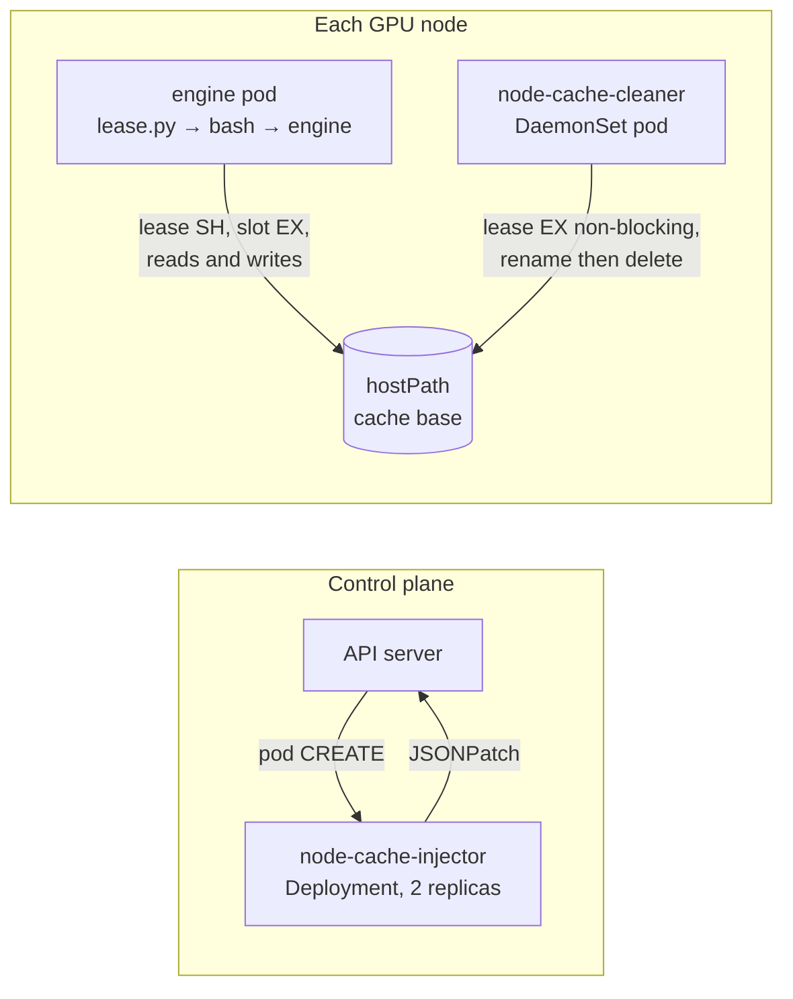

# Node cache: injector webhook and cleanup DaemonSet

**Status:** proposed, 2026-09-18. Nothing here is built. The sglang chart keeps
its embedded `cache_manager.py`, garbage collector included, until the rollout
phases below land.

This design splits the sglang chart's host compile cache into two cluster
components:

- **node-cache-cleaner**, a DaemonSet that deletes caches nobody is using, for
  every release and model on the node.
- **node-cache-injector**, a mutating admission webhook that adds the cache
  wiring to a pod at creation time, so engine charts only set a label and a few
  annotations.

The in-pod lease stays what it is today: a small Python wrapper holding `flock`
locks for the engine's lifetime. Neither new component holds a lock on a pod's
behalf, and neither sits in a pod's startup path.

## Where things stand

With `cache.enabled: true`, the sglang chart does everything itself:

- **Mount.** It mounts the hostPath `<cache.hostPath>/<hostPathSuffix>` at
  `/var/cache/sglang-host`. The suffix defaults to the model directory
  (`model.name` with `/` and `:` folded to `--`), so releases serving one model
  on a node share its compiled kernels. The mount is therefore already one
  model's directory, and the wrapper only ever sees template hashes.
- **Wrapper.** It ships `cache_manager.py` in a ConfigMap and starts the engine
  as `exec python3 cache_manager.py -- sglang serve …` inside the container's
  `bash -lc` script.
- **Lease.** The wrapper takes the template's lease (shared) and a slot lock
  (exclusive), sets `SGLANG_CACHE_DIR` and `HF_HOME` to the slot, and links
  `~/.cache/sglang` to it.
- **In-pod GC.** Before the `exec`, the wrapper deletes templates in its own
  mounted directory beyond `historyLimit`, but only ones whose lease it can take
  exclusively. A purge takes both the data directory and the template's lock
  directory, in the order the contract below fixes. It skips `.locks` while
  scanning, since that is not a template.
- **Exec.** It `exec`s the engine. The lock file descriptors are inherited, so
  the kernel holds both locks until the engine exits.

The template hash covers image repository and tag, model name, context length,
`extraArgs` and `env`. It is computed by the chart
(`sglang.cacheTemplateHash`).

## Problems

**P1. Caches outlive their release.** The GC only sees its own mounted
directory, and only runs when a pod using that directory starts. Once a model is
retired, or a release is uninstalled and no other release serves that model on
the node, nothing ever looks at the directory again. This is the one that fills
disks. An empty `.locks/` is left behind even after the last template goes, so
the directory itself never disappears either.

**P2. The GC ranks templates by last start, not last use.** `.last_used` is
written when a pod starts and never again. A template whose pods have run for
weeks looks like the oldest one. During any brief gap in its lease, such as a
crash restart or a `rollout restart`, another template's GC can delete it, and
the next start pays the full cold compile.

**P3. Cleanup is in the startup path.** A large `rmtree` delays the engine's
`exec`, and changing `historyLimit` changes the pod spec and rolls every
inference pod.

**P4. The wiring is chart-specific.** The vllm chart would need its own copy of
the ConfigMap, volume, env vars, command wrapping and validation.

## Goals

- Caches from uninstalled releases, renamed releases and retired models are
  deleted without anyone remembering to.
- A cache that any process holds is never deleted, and a cache being deleted is
  never handed to a pod. This is the same guarantee the lease gives today.
- Pods start without depending on either component. If one is down, the result
  is a cold cache or a paused cleanup, never a pod that can't start.
- One mechanism for sglang, vllm and future engine charts.
- The lock protocol and on-disk layout stay compatible, so a node can run
  embedded-mode pods, injected-mode pods and the cleaner side by side.

## Non-goals

- Sharing caches across nodes, or pre-warming a node.
- Replacing `flock` leasing with a central allocator.
- Changing what the template hash covers.
- A CSI driver (see [Alternatives](#alternatives-considered)).

## Overview



The filesystem is the interface. Pods and the cleaner never talk to each other.
They agree on a directory layout and a locking protocol, and the kernel's
`flock` does the coordinating. The injector only acts once per pod, before the
pod is scheduled. After that it is out of the picture.

The two components are independent, and each is useful on its own:

- **Cleaner alone** fixes P1 and P2 for pods that still use the embedded
  wrapper.
- **Injector alone** fixes P4, but leaves cleanup to the in-pod GC.

## The contract

Everything below is shared by the embedded wrapper, the injected wrapper and
the cleaner. It is today's layout, plus `.trash/`.

```
<base>/                         cache.hostPath, e.g. /mnt/disk0/sglang-cache
└── <root>/                     today: hostPathSuffix, i.e. one model's directory
    ├── <hash>/                 one template
    │   ├── .last_used          mtime = last time this template was known to be in use
    │   └── slot-N/             a cache; the engine's cache variable points here
    ├── .locks/                 never a template, never deleted
    │   └── <hash>/
    │       ├── .lease          shared by every holder of the template
    │       └── slot-N.lock     exclusive, one holder
    └── .trash/                 new: templates unlinked by the cleaner, awaiting deletion
```

**A root** is `<base>` or a direct child of `<base>` that contains a `.locks/`
directory, and holds the templates of one model. The lock tree is never deleted,
so a root stays discoverable after the last release using it is gone.

Locking rules:

1. **A holder takes `.lease` shared before touching anything under `<hash>/`,**
   and keeps it for its whole life. This is the only acquisition that may block.
   It blocks while holding nothing.
2. **A holder then takes one `slot-N.lock` exclusive, without waiting,** trying
   slots from 0 upwards, and keeps it for its whole life.
3. **A deleter (in-pod GC or cleaner) takes `.lease` exclusive, without
   waiting,** and gives up if it can't. It never waits, so the protocol can't
   deadlock.
4. **Lock files are unlinked only by a purge, in this order:** the slot locks
   first, then the data, then `.lease` last, and after that nothing but an
   `rmdir` of the emptied directory. `flock` locks an inode, not a path, so
   while `.lease` is still at its path every arrival queues on the inode the
   purger holds, and no slot lock can be held or opened. Once `.lease` is gone
   that guarantee is gone with it, which is why nothing follows it.
5. **Every lease acquisition rechecks the inode** -- `fstat(fd).st_ino` against
   `stat(path).st_ino` -- and retries when they differ. A pod already blocked on
   a lease that a purge then unlinks wakes holding an orphan, which guards
   nothing: the next arrival creates a new file at that path, and the two never
   see each other. Slot locks need no such check, since they are only opened
   under a verified lease and only unlinked under an exclusive one.
6. **`.last_used` is written by holders when they start, and by the cleaner
   whenever it finds the lease held.** Its mtime therefore means "last known to
   be in use", which is what the deletion policy needs.

A holder drops every lock when its process exits, crash included, because the
kernel releases them.

**Versioning.** The cleaner writes `<base>/.node-cache-version` containing `1`
if absent. A future incompatible layout bumps it. The cleaner refuses to touch
a base whose version it doesn't know, and wrappers log a warning.

## Component: node-cache-cleaner

### Shape

- **DaemonSet** on GPU nodes, with the same node selectors and tolerations as
  the engine pods.
- **One hostPath volume**: `<base>`, read-write, at the same path inside the
  container. It needs one base per configured `cache.hostPath` if releases
  differ.
- **No Kubernetes API access.** `automountServiceAccountToken: false`, no RBAC.
  It only reads and writes the filesystem.
- **Runs as root**, because the cache is owned by root, with
  `readOnlyRootFilesystem: true` and no other mounts.
- **Small requests.** Deletions run under `ionice -c3` and `nice`, so they
  yield to engines loading weights from the same disk.

### Sweep

Every `interval` (default 10 minutes), for each base:

1. **Empty the trash.** Delete everything under each root's `.trash/`. Nothing
   there is reachable by a pod: see [Purging](#purging).
2. **Discover templates.** For each root, list `<root>/<hash>/` directories.
   Skip names that start with `.`, `.locks` above all, and skip any child of a
   root that is itself a root. When one release mounts `<base>` directly and
   others mount `<base>/<model>`, the second kind would otherwise look like
   templates of the first.
3. **Probe and refresh.** For each template, try its `.lease` exclusive without
   waiting.
   - **Held:** update `.last_used` to now, and keep the template.
   - **Acquired:** release it immediately. The template is idle right now.
4. **Rank.** Within each root, sort templates by `.last_used`, newest
   first. Refreshing in-use templates in step 3 makes them rank as new, which
   fixes P2.
5. **Decide** each idle template with the [policy](#deletion-policy).
6. **Purge** each one marked for deletion, rechecking under the lease.

### Deletion policy

Evaluated only for templates whose lease was free in step 3. The first
matching row wins.

| Condition | Result |
|---|---|
| idle less than `minIdle` (default 1h) | keep |
| rank < `keepPerRoot` (default 2) and idle less than `maxIdle` (default 7d) | keep |
| otherwise | purge |

"Idle" is now minus `.last_used`. Rank counts every template in that root,
held or not, so `keepPerRoot: 2` keeps the running template and one previous one
warm, which matches today's `historyLimit: 2`. A root is one model's directory
by default, so this is per model.

The two limits cover different cases:

- **`keepPerRoot`** bounds a live model's history.
- **`maxIdle`** eventually deletes every template of a release that is gone,
  which is what fixes P1.
- **`minIdle`** protects a template whose pod just exited, for example during a
  rollback, from being deleted by the count rule.

A later version can add a disk watermark: above `highWatermark` usage, purge
idle templates oldest first, ignoring `keepPerRoot` and `maxIdle` but never a
held lease, until usage is below `lowWatermark`.

### Purging

For each template marked for deletion:

1. Take `.lease` exclusive, without waiting, and recheck its inode (rule 5). If
   held, skip: a pod started since step 3.
2. Re-read `.last_used`. If the policy no longer says purge, release and skip.
3. Unlink the template's `slot-*.lock` files.
4. `rename(<root>/<hash>, <root>/.trash/<hash>--<unix-ts>)`.
   Both paths are on the same filesystem, so this is atomic.
5. Unlink `.lease`, then `rmdir` its directory, ignoring a failure: a pod
   arriving in the last moments owns that directory now.
6. Release the lease.
7. Delete the trash entry, outside the lease.

Renaming first has two benefits over deleting in place:

- **Pods wait milliseconds, not minutes.** A pod starting the same template
  waits on its shared lease only for the rename, not for the whole delete.
- **A half-deleted cache is never visible.** If the cleaner crashes mid-delete,
  the leftover is in `.trash/`, where no pod looks, and the next sweep finishes
  it. No compiler cache promises to handle a partly deleted tree, so it should
  never see one.

The lock directory under `.locks/` stays, per rule 4.

### Coexisting with the in-pod GC

The in-pod GC and the cleaner both take the lease exclusive without waiting,
so at most one of them acts on a template at a time. Either can delete a
template the other would have kept, which is harmless. The cleaner can
therefore ship while every pod still runs the embedded wrapper, and the in-pod
GC can be removed later.

The cleaner's `.last_used` refresh also improves the in-pod GC's ranking, since
it reads the same file.

### Failure modes

| Failure | Effect |
|---|---|
| Cleaner not deployed or crashlooping | No cleanup. Pods unaffected. Alert on DaemonSet unavailability and disk usage. |
| Cleaner crashes mid-purge | Lease released by the kernel. The template is either untouched or fully in `.trash/`. |
| Node reboots | Same as above. Holders are gone, so their leases are free. |
| Base configured wrong | Cleaner finds no roots and logs it. Nothing deleted. |
| Unknown `.node-cache-version` | Cleaner skips that base and logs it. |

### Values sketch

```yaml
cleaner:
  enabled: true
  bases:
    - /mnt/disk0/sglang-cache
  interval: 10m
  minIdle: 1h
  maxIdle: 168h
  keepPerRoot: 2
  nodeSelector: {}
  tolerations: []
  resources:
    requests: { cpu: 50m, memory: 64Mi }
    limits: { memory: 256Mi }
```

## Component: node-cache-injector

### Shape

The same structure as `charts/rdma-injector`:

- **Deployment** with 2 replicas spread across nodes.
- **TLS:** serving certificate self-signed by Helm on install and reused on
  upgrade through `lookup`.
- **`MutatingWebhookConfiguration`:**
  - operations: `CREATE` on `pods`
  - `objectSelector`: `node-cache: "true"`
  - `namespaceSelector` excluding its own namespace
  - `sideEffects: None`, `timeoutSeconds: 5`, `reinvocationPolicy: IfNeeded`
- **No API calls and no RBAC.** Everything it needs is in the admission request.

**`failurePolicy: Ignore`.** This is the opposite of `rdma-injector`. A pod
without RDMA wiring is broken; a pod without cache wiring is only slow on its
first start. Letting pods through when the webhook is down is the right
trade-off here.

### Why the webhook can't choose the slot

Admission happens before scheduling. The webhook doesn't know which node the
pod will land on, let alone which slots are free there, and a pod's volumes and
command can't be changed after creation. So the webhook can only inject what
runs on the node: the wrapper that takes the slot when the container starts.
`rdma-injector` hits the same limit for the same reason.

### What the chart provides

On the pod template:

```yaml
metadata:
  labels:
    node-cache: "true"
  annotations:
    node-cache/engine: sglang            # selects the wrapper's env profile
    node-cache/root: <model dir>         # same as today's hostPathSuffix
    node-cache/template-hash: <sglang.cacheTemplateHash>
    node-cache/max-slots: "8"
    node-cache/container: sglang         # optional; default: first container
```

**The chart keeps computing the template hash.** The webhook could hash the pod
spec instead, but the chart knows which inputs matter. For example, LWS rank
flags differ between pods of one group and shouldn't split the cache.

**`node-cache/root` defaults to today's suffix,** the model directory, so
injected pods use the same directories as embedded ones and a migration starts
warm.

### The mutation

All operations are idempotent. The webhook skips any step already applied and
marks the pod with `node-cache/injected: <version>`.

1. **Volume** `node-cache-host`: hostPath `<base>/<root>`, `DirectoryOrCreate`.
   `<base>` is injector configuration, not a pod annotation, so a labelled pod
   can't point the hostPath at an arbitrary node path. The webhook rejects a
   `node-cache/root` that isn't a single plain path segment.
2. **Mount** it on the target container at the path the engine profile names.
   For sglang that is `/var/cache/sglang-host`, today's path, so the paths the
   engine sees don't change across the migration.
3. **Wrapper delivery**: see [below](#delivering-the-wrapper).
4. **Env** on the target container: `NODE_CACHE_DIR`, `NODE_CACHE_ENGINE`,
   `NODE_CACHE_MODEL`, `NODE_CACHE_TEMPLATE_HASH`, `NODE_CACHE_MAX_SLOTS`.
5. **Command wrap** on the target container:

   ```
   command: [python3, /opt/node-cache/lease.py, --, <original command…>]
   args:    unchanged
   ```

   The resulting process chain is `lease.py → bash -lc → engine`, all by
   `exec`, so PID 1 and the inherited lock descriptors carry through.

The webhook skips a pod, and records `node-cache/skipped: <reason>`, when:

- the target container has no explicit `command`. The webhook can't see the
  image's `ENTRYPOINT`, so it has nothing to wrap.
- the container already carries `SGLANG_CACHE_HOST_DIR` or `NODE_CACHE_DIR`.
  It is already wired, by the embedded chart or an earlier pass.

The target container must have `python3` on its `PATH`. The sglang and vllm
images do.

### Delivering the wrapper

`lease.py` has to be a file in the container, and a ConfigMap only exists in
its own namespace. The recommended option:

- **Init container** (recommended). The webhook adds an init container running
  the `node-cache` image, which copies `lease.py` into an `emptyDir` mounted at
  `/opt/node-cache` in the target container. Each pod pins the wrapper version
  of the image tag the webhook injected, and nothing depends on node state. The
  cost is one small image pull per node and a second or two at startup.

Other options:

- **Inline `python3 -c`.** No image and no volume. But several kilobytes of
  source land in the pod's command, which makes `kubectl describe` unreadable.
- **hostPath installed by the cleaner.** No image either. But pod startup then
  depends on the cleaner having run on that node, and nodes can end up running
  different wrapper versions.

A single `node-cache` image carries the webhook server, `lease.py` and the
cleaner, each started with a different entrypoint.

### Coexisting with rdma-injector

`rdma-injector` only prepends its `source` when `command[0]` is `bash` or `sh`.
Once `node-cache-injector` has wrapped the command, `command[0]` is `python3`,
and RDMA injection silently stops, depending on which webhook runs first.
Webhook order isn't something to rely on.

**Required before the injector ships:** `rdma-injector` looks for the shell
after the first `--` in `command` when one is present. It must not just search
for `-c` anywhere, because `python3 -c` would match. Its edit (replacing the
last element of `args`) is untouched by the command wrap, so the two mutations
then work in either order.

### Failure modes

| Failure | Effect |
|---|---|
| Webhook down or slow | Pod created without injection. Engine starts with an in-container cache: cold, working. |
| No explicit `command` | Skipped, with `node-cache/skipped: no-command`. |
| Image lacks `python3` | Container fails to start: the runtime can't find the executable. Remove the label for that workload. |
| All slots busy on the node | Wrapper exits non-zero, same as today. |

### Values sketch

```yaml
injector:
  enabled: true
  replicas: 2
  base: /mnt/disk0/sglang-cache
  failurePolicy: Ignore
  objectSelectorLabels:
    node-cache: "true"
  wrapperImage: <registry>/node-cache:<tag>
```

## Wrapper changes

`cache_manager.py` becomes `lease.py`. It stays Python, and stays a wrapper
that `exec`s its command. The changes come with the phases below:

- **Env input.** Read `NODE_CACHE_*`, falling back to today's `SGLANG_CACHE_*`,
  so the embedded chart keeps working unchanged.
- **Engine profiles.** A small table maps `NODE_CACHE_ENGINE` to the cache
  variables to set and the default-path symlink to create:
  - `sglang`: `SGLANG_CACHE_DIR`, `HF_HOME`, `~/.cache/sglang`.
  - `vllm`: still to be worked out. `VLLM_CACHE_ROOT` alone does not cover
    Triton's cache.
- **Remove the in-pod GC** once the cleaner runs everywhere. `historyLimit`
  becomes the cleaner's `keepPerRoot`.
- **Tests.** The existing multi-process tests in
  `charts/sglang/test-cache-manager.py` move with the wrapper. Add an
  end-to-end case for the `lease.py → bash → engine` chain, checking the locks
  survive both `exec`s.

## Safety invariants

These hold across embedded pods, injected pods, the in-pod GC and the cleaner,
and follow from the contract:

1. **A template's data is never deleted while any process holds its lease.**
   Deleters act only while holding it exclusive.
2. **A pod never uses data that is being deleted.** A pod reaches the data only
   after taking the lease shared. The cleaner renames the data away while
   holding it exclusive, so a later pod finds no directory and starts cold.
3. **No two live processes share a slot.** Slot locks are exclusive, and a slot
   lock file is unlinked only while a purger holds the lease exclusively, when
   by rule 1 no holder exists and none can arrive.
4. **No deadlock.** Only holders ever block, on the lease, holding nothing.
   Deleters never block.
5. **Pods never depend on the cleaner or injector being up.** Only their
   absence has an effect: no cleanup, or a cold cache.

## Rollout

Each phase ships and rolls back on its own.

**Phase 0: today.** Embedded wrapper with in-pod GC. No change.

**Phase 1: cleaner.**
- Build the `node-cache` image and chart, with only the cleaner enabled.
- Deploy it on GPU nodes against the existing `cache.hostPath` bases.
- Leftover directories from uninstalled releases start disappearing after
  `maxIdle`.
- Fixes P1 and P2.

**Phase 2: slimmer wrapper.**
- Add engine profiles and `NODE_CACHE_*` env to the wrapper.
- Remove its GC, and deprecate `cache.historyLimit` in the sglang chart.
- Fixes P3.
- Requires phase 1 on every node that runs cached pods.

**Phase 3: injector.**
- Ship the `rdma-injector` detection fix first.
- Deploy the injector, and add `cache.mode: embedded | injected` to the sglang
  chart. Keep `embedded` as the default until injected mode has run in
  production.
- Adopt the label and annotations in the vllm chart.
- Fixes P4.

**Rollback:**
- **Phase 1:** uninstall the cleaner; the in-pod GC still runs.
- **Phase 2:** re-release the previous wrapper, which brings the in-pod GC
  back. The reverse dependency is the one to watch: never uninstall the cleaner
  while pods run the GC-less wrapper, or nothing cleans those nodes.
- **Phase 3:** switch the chart back to `cache.mode: embedded`. Pods started in
  injected mode keep working until they restart.

## Alternatives considered

**In-pod node-wide sweep.** Mount `<base>` in every engine pod and let each
pod's GC clean every release. No new component, but it only runs when a cached
pod starts on that node. It also gives every pod write access to every
release's cache, and makes the in-pod script larger rather than smaller.
Rejected: the in-pod part should stay minimal.

**CSI inline ephemeral volume driver.** The driver would hand each pod its slot
as a volume and release it after the pod is gone, so pods need no wrapper at
all. It doesn't involve the scheduler. But it is a Go gRPC driver with a
registrar sidecar and bidirectional mount propagation. It has to rebuild its
slot table after a crash from kubelet state. Pods can't start while it is down.
And "released after the pod is gone" depends on kubelet reporting, where `flock`
depends only on the process exiting. Rejected on complexity.

**Central allocator over a socket or the API.** Pods would ask a daemon for a
slot. Startup depends on the daemon, and the daemon has to infer pod liveness
from the API server, which lags and is wrong after a force delete. Rejected.

**Helm pre-delete hook.** A hook Job can't reach every node's hostPath, and
misses nodes that are down during uninstall. Rejected.

**Bash lease snippet sourced into the container's shell.** The webhook would
prepend `. lease.sh;` to the `bash -lc` script instead of wrapping the command.
Bash opens the lock descriptors itself, and they survive `exec engine`. This
avoids the command wrap and the `rdma-injector` change entirely. Not chosen:
the wrapper stays Python, with the existing tests.

## Open questions

1. **Root key for injected pods.** This doc keeps today's per-model root, which
   already shares kernels between releases serving one model. Alternatives:
   - one root per namespace and model: teams never share compiled kernels, at
     the cost of a cold start for a blue/green move into a new namespace
     (see `docs/blue-green-migration.md`);
   - one root per release, which is what the chart did before: no sharing at
     all, and one abandoned directory per uninstall.
2. **Wrapper delivery.** Init container (recommended) or inline `python3 -c`.
3. **Defaults** for `interval`, `minIdle`, `maxIdle`, `keepPerRoot`, and
   whether the disk watermark belongs in phase 1.
4. **Packaging.** One `node-cache` chart with both components toggleable, or
   two charts. Image name and registry path in the air-gapped harbor.
5. **The vllm engine profile:** which variables and symlinks cover all of its
   compile caches.
6. **Observability.** Logs only, or a node-exporter textfile (bytes per root and
   template, purges, last sweep time) written by the cleaner.
7. **The last empty directories.** A purge now removes a template's lock
   directory too, but `<root>/.locks/` itself and `<root>/` stay behind once the
   last template is gone. Removing those means deleting a directory a pod may be
   about to `makedirs` into; the wrapper already retries a lease whose directory
   vanished, so it is doable, but the gain is two empty directories per retired
   model.
