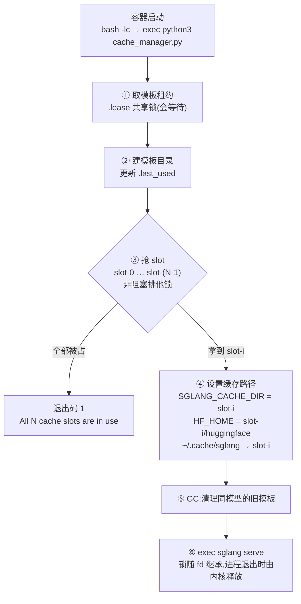

# sglang 主机编译缓存(内嵌 cache_manager.py)

sglang chart 开启 `cache.enabled` 后,每个 pod 在启动 sglang 之前先运行
`charts/sglang/files/cache_manager.py`,把 Triton、Inductor、FlashInfer、DeepGEMM
等编译缓存放到节点本地盘,并保证:

- **热启动**:pod 在同一节点重启时复用已编译的 kernel(冷编译约 40 分钟,热启动约 10 分钟)
- **互斥**:同一节点上同时运行的多个 pod 绝不写同一个缓存目录
- **清理**:旧版本缓存会被清理,正在使用的永远不会被删

把清理移出 pod 的后续方案见 [node-cache-design.md](node-cache-design.md)。

## 开启

```yaml
cache:
  enabled: true
  hostPath: /mnt/disk0/sglang-cache   # 节点上的缓存根目录
  # hostPathSuffix: ""                 # 默认为模型目录:model.name 中 / 和 : 换成 --
  historyLimit: 2                      # 该目录下保留几个模板,含当前模板
  maxSlotsPerNode: 8                   # 同一模板在一个节点上最多几个 pod 同时运行
```

- **共享范围**:`hostPathSuffix` 默认是模型目录,所以同一节点上服务同一模型的多个 release
  **共用**编译缓存,不同模型各自分开。共用是安全的:模板 hash 仍然隔离了不兼容的镜像和参数,
  slot 锁仍然保证并发 pod 不写同一个目录。想让某个 release 独占,把它显式设成 release 名即可。
- **不生效的情况**:设置了 `commandOverride` 时缓存不生效,因为没有 sglang 命令行可包装。
- **挂载限制**:不要在 `/root/.cache/sglang` 挂 volume,chart 会直接报错;挂在 `/root/.cache` 没问题。
- **版本要求**:sglang 版本需支持 `SGLANG_CACHE_DIR`。

## chart 做了什么

- **脚本**:`files/cache_manager.py` 放进 ConfigMap `<fullname>-cache-manager`,挂到 `/opt/sglang-cache`。
- **目录**:节点目录 `<hostPath>/<hostPathSuffix>` 以 hostPath 方式挂到容器内的 `/var/cache/sglang-host`。
  挂进来的已经是这个模型自己的目录,所以脚本里不再需要模型名,它看到的就是一棵模板 hash 的树。
- **参数**:通过环境变量传入。

  | 变量 | 来源 |
  |---|---|
  | `SGLANG_CACHE_HOST_DIR` | 固定为 `/var/cache/sglang-host` |
  | `SGLANG_CACHE_TEMPLATE_HASH` | 模板 hash,见下 |
  | `SGLANG_CACHE_MAX_SLOTS` | `cache.maxSlotsPerNode` |
  | `SGLANG_CACHE_HISTORY_LIMIT` | `cache.historyLimit` |

- **启动命令**:变为

  ```bash
  exec python3 /opt/sglang-cache/cache_manager.py -- sglang serve <flags...>
  ```

**模板 hash** = `sha256(image.repository, image.tag, model.name, model.contextLength, extraArgs, env)`
取前 10 位。任何一项变化都会得到新模板:使用新目录,冷启动。`env` 中通过
`valueFrom` 引用的项只计入变量名。

## 目录布局

```
/var/cache/sglang-host/            即节点上的 <hostPath>/<hostPathSuffix>,默认是一个模型的目录
├── <hash>/                        一个模板
│   ├── .last_used                 mtime = 最近一次有 pod 启动的时间
│   ├── slot-0/                    一份缓存,SGLANG_CACHE_DIR 指向这里
│   └── slot-1/
└── .locks/                        永远不是模板,GC 扫描时跳过
    └── <hash>/
        ├── .lease                 模板租约:使用者加共享锁,GC 加排他锁
        └── slot-N.lock            slot 锁:一个 pod 独占
```

**锁文件放在数据目录之外,删除时有严格顺序。** flock 锁的是 inode 而不是路径:锁文件一旦被删除重建,
旧 pod 锁着旧 inode,新 pod 锁住新 inode,两者都以为自己拿到了同一个 slot。所以锁不能"顺手"跟着
`rm -rf <hash>/` 一起没掉,而要由 GC 在持有排他租约时按顺序删,详见 [GC 规则](#gc-规则)。

另外 GC 扫描 `/var/cache/sglang-host/` 时会跳过 `.locks` 这个名字,不会把它当成一个模板 —— 否则一次误删
就会把节点上所有模板(包括正在用的)的锁文件一起 unlink 掉。

## 启动流程



1. **取模板租约。** 对 `.locks/<hash>/.lease` 加共享锁。多个 pod 可以同时持有;只有 GC
   正在删除这个模板时才需要等待(GC 删完即释放)。取不到租约(例如目录无权限)时直接退出。
   租约在创建任何数据目录之前获取,因此 GC 看到的模板要么没人使用,要么已有 pod 持有租约。
2. **标记使用。** 创建 `<hash>/`,并更新 `.last_used` 的 mtime,GC 按它排序。
3. **抢 slot。** 从 slot-0 开始依次对 `slot-N.lock` 加非阻塞排他锁,第一个加锁成功的就是本 pod 的 slot。
   重启的 pod 通常会拿回原来的 slot,所以缓存是热的。全部被占说明该节点上同模板的 pod 数超过了
   `maxSlotsPerNode`,进程退出,pod 重启。
4. **设置缓存路径。** `SGLANG_CACHE_DIR` 直接设为 slot 目录,sglang 的 Triton、Inductor、FlashInfer、
   DeepGEMM、CUDA 驱动缓存都在它下面;`HF_HOME` 设为 slot 下的 `huggingface/`。另外把
   `~/.cache/sglang` 替换为指向 slot 的软链,供直接使用默认路径的代码;软链失败只打 warning。
   **故意不设** `TRITON_CACHE_DIR` 等单独的变量:设了反而会让那一项脱离 `SGLANG_CACHE_DIR`。
5. **GC。** 规则见下一节。GC 同步执行,删除大目录会推迟 sglang 启动;GC 出错只打 warning,不影响启动。
6. **exec。** `os.execvp` 把当前进程替换为 sglang,PID 不变,两把锁的 fd 被继承,sglang 运行多久锁就持有多久。
   进程退出(包括崩溃、OOM、被 kill)时内核自动释放锁。

## GC 规则

只处理挂载目录(默认就是当前模型的目录)下的模板:

1. **列举。** 扫描 `/var/cache/sglang-host/` 下的目录,跳过 `.locks`。
2. **排序。** 按 `.last_used` 从新到旧排序;没有 `.last_used` 的用目录 mtime。
3. **保留。** 当前模板占一个名额,再保留最新的 `historyLimit - 1` 个其他模板。
4. **尝试删除。** 其余模板逐个尝试对其 `.lease` 加**非阻塞排他锁**:
   - **加锁失败**:还有 pod 在使用或正在启动,跳过(`GC: Cache <hash> is leased, skipping`)。
   - **加锁成功**:两个 `<hash>` 目录一起删(`GC: Purging abandoned template cache <hash>`),
     顺序固定:
     1. 删 `.locks/<hash>/slot-*.lock`
     2. 删数据目录 `<hash>/`
     3. **最后**删 `.locks/<hash>/.lease`
     4. `rmdir .locks/<hash>/`,然后释放锁

**顺序为什么是这样。** 只要 `.lease` 还在原路径上,任何新来的 pod 打开的都是 GC 手里这个 inode,一定被挡在
共享锁那一步:所以第 1、2 步期间不可能有人持有 slot 锁、也不可能有人在读数据。`.lease` 一旦被 unlink,
这个保证就没了,所以它放在最后,而且之后 GC 只会 `rmdir` 一个空目录,不再删任何东西。

**加锁方的配合。** 一个在 GC 删之前就已经阻塞在 `.lease` 上的 pod,会在 GC 释放时拿到那个**已经被 unlink 的
inode** 上的锁 —— 锁住了一个谁也看不见的文件,等于没锁。所以每次加锁后都会核对
`fstat(fd).st_ino == stat(path).st_ino`,不一致就关掉重来,去锁替代它的那个新文件(见 `take_lease()`)。
**两边都要校验**:孤儿同样可能落在 GC 手里(它在 `open` 和 `flock` 之间被调度走),那时使用者再守规矩也没用。

slot 锁则**不需要**校验:它只会在有人持有已校验的排他租约时被删,而那一刻不可能有人持有它、也不可能有人
正要打开它 —— 因为进门必须先过 `.lease` 这一关。反过来,这也意味着协议之外的 `rm` 是救不回来的:校验只发生在
加锁那一刻,文件在那之后被删掉,已经持有的锁就再也说明不了什么。

例:`historyLimit: 2`,节点上有模板 A(当前)、B(上一版本)、C(更早)。保留 A 和 B;C 没人使用就删除。

## 常见场景

| 场景 | 结果 |
|---|---|
| pod 在同一节点重启 | 旧进程退出后锁被释放,新进程拿回同一 slot,热启动 |
| 同模板的两个 pod 同时在一个节点启动 | 各拿一个 slot(slot-0、slot-1),互不干扰;slot-1 第一次是冷的 |
| 同一模型的两个 release 在一个节点 | 默认共用同一个模型目录:模板 hash 相同就复用同一份缓存(各占一个 slot),不同就各用各的模板目录 |
| 滚动更新(新 hash) | 新 pod 使用新目录,冷启动。旧 pod 仍持有旧模板租约,GC 跳过;旧 pod 退出后,旧模板若在 `historyLimit` 以内则保留,可用于回滚 |
| GC 与正要使用该旧模板的 pod 同时发生 | 先加锁者优先。GC 先:pod 等删除完成后重建目录(冷);pod 先:GC 跳过 |
| pod 崩溃、被 OOM kill、节点重启 | 内核释放锁,没有残留状态 |
| 节点 slot 用完 | 容器以退出码 1 退出,日志 `All N cache slots are in use` |

## 已知限制

- **不会被清理的缓存。** 换掉的模型、卸载后不再有 pod 落到该节点的 release,它们的缓存永远不会被清理:
  GC 只在本 release 的 pod 启动时运行,并且只看自己挂载的那个模型目录。需要手动清理(见下),或等待
  [node-cache-design.md](node-cache-design.md) 中的 cleaner。
- **模型目录本身不会消失。** 模板的两个目录都会被 GC 删掉,但 `.locks/` 这一层和模型目录自己不会:
  即使某个模型的模板全被清空,`<hostPathSuffix>/.locks/` 仍然作为空目录留着。占的是 inode 不是空间。
- **`.last_used` 只在启动时更新。** 长期运行的模板看起来最旧;如果它恰好在无人持有的间隙(例如重启时)
  遇到其他模板的 GC,可能被删,下次启动变冷。
- **GC 同步执行。** 删除大目录会拖慢启动。
- **共享的 `~/.cache`。** 如果 `~/.cache` 是多个 pod 共享的 volume,`SGLANG_CACHE_DIR` 不受影响,但默认路径的
  软链会被后启动的 pod 改掉。
- **误导性的报错。** 锁目录无权限等错误同样报为 `All N cache slots are in use`。

## 排障

正常启动日志:

```
[cache-mgr] Acquired slot-0 (fd 4) for template 3f9a1c2b7e (lease fd 3)
[cache-mgr] SGLANG_CACHE_DIR=/var/cache/sglang-host/3f9a1c2b7e/slot-0
[cache-mgr] GC: Cache 1a2b3c4d5e is leased, skipping
[cache-mgr] GC: Purging abandoned template cache 0f0e0d0c0b
```

| 日志 | 含义 |
|---|---|
| `ERROR: All N cache slots are in use on this node` | 同模板在该节点上的 pod 数超过 `maxSlotsPerNode`,或锁目录无权限 |
| `ERROR: Cannot lease template in ...` | 锁目录不可写,检查 hostPath 权限 |
| `Warning linking /root/.cache/sglang: ...` | 软链失败;缓存照常可用,只是默认路径不在主机盘上 |
| `Warning during garbage collection: ...` | 本次 GC 中断,不影响启动 |

在节点上查看哪些进程占着某个模板的锁:

```bash
M=/mnt/disk0/sglang-cache/<model>        # hostPathSuffix 目录,默认是模型名
fuser -v "$M/.locks/<hash>/.lease" "$M/.locks/<hash>"/slot-*.lock
```

**手动删除某个模板的数据**,用与 GC 相同的方式加锁再删,有 pod 在使用时会直接失败:

```bash
flock -xn "$M/.locks/<hash>/.lease" rm -rf "$M/<hash>"
```

- 这样会留下 `.locks/<hash>/`,是安全的。想把锁目录也删掉,就得照 GC 的顺序来
  (slot 锁 → 数据 → `.lease` → `rmdir`),不如直接让 GC 去做。
- **不要在没拿到排他租约的情况下删任何锁文件**,原因见上文。
- **例外**:确认该模型在这个节点上已经没有 pod 在跑(且不会马上有),可以整个删除 `$M/`,
  锁文件一起删掉也没关系 —— 此时没有任何进程持有或即将打开它们。

## 测试

```bash
python3 charts/sglang/test-cache-manager.py
```

不需要集群或 GPU,覆盖 slot 互斥、租约、GC、缓存路径设置和端到端 exec。
